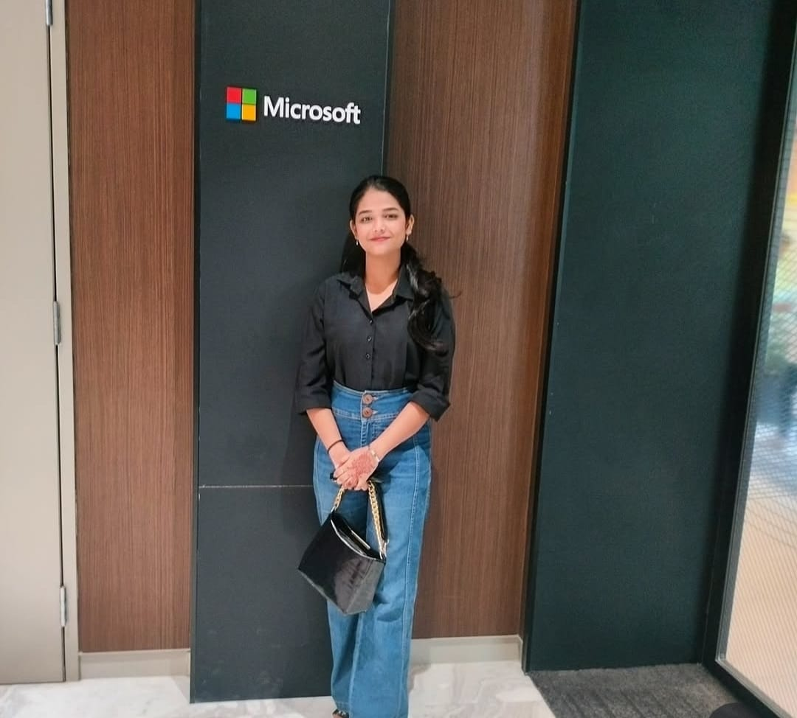

<!-- Header Banner Area -->
<div align="center">
  <a href="https://bento.me/steeltroops">
    
  </a>
</div>

<!-- Profile Section -->
<table width="100%" cellpadding="18" cellspacing="0">
  <tr>
    <td width="30%" align="center" valign="middle">
      <div style="display: flex; justify-content: center; align-items: center; height: 100%;">
        
      </div>
    </td>
    <td width="70%" align="left" valign="center">
      <h1 style="margin: 0; color: #374151;"> Akansha (December 𖠌)</h1>

> **22 | e/λ | ml · swe · ロボ · qmech | intj · 🐈‍⬛ | ex-@orbitxindia | 8x hackathon wins**

[](https://git.io/typing-svg)

**`Data Analyst | Strategic & Elegent Development and Analysis`**


</td>

  </tr>
</table>

### 🌙 Current Status

<table width="100%" cellpadding="22" cellspacing="0" style="margin: 20px 0;">
  <tr>
    <td width="55%" align="left" valign="top">

```yaml
STATUS: 📊 Analyzing & Delivering Insights
ROLE: 📈 Data Analyst • BI Developer • Storyteller
MISSION: 🎯 Turning raw data into actionable business decisions
EXPERTISE: ["Data Cleaning", "SQL", "Python", "Power BI", "Tableau", "Excel"]
LANGUAGES: ["English", "Hindi"]
ACHIEVEMENTS: 🏆 Built interactive dashboards & predictive models
CURRENT: 🔍 Exploring datasets & creating business intelligence reports
PERSONALITY: 📐 Analytical • Detail-Oriented • Curious

```

</td>
    <td width="45%" align="center" valign="center">
      
    </td>
  </tr>
</table>

### 🎯 Current Focus

<table width="100%" cellpadding="28" cellspacing="0" style="border-collapse: collapse;">
  <tr>
    <td width="50%" align="left" valign="top" style="border-right: 2px solid #2563EB;">

**📊 Business Intelligence**

- Building dashboards (Power BI, Tableau, Excel)  
- Monitoring KPIs & performance metrics  
- Data storytelling for business decisions  

**🛠 Data Analysis**

- SQL queries & database management  
- Python (Pandas, NumPy, Matplotlib, Seaborn)  
- Data cleaning, preprocessing & automation  

    </td>
    <td width="50%" align="left" valign="top" style="padding-left: 28px;">

**🔍 Research & Insights**

- Market trend & customer behavior analysis  
- Forecasting & predictive modeling  
- Turning raw datasets into actionable insights  

**🌐 Community & Growth**

- Sharing knowledge through projects  
- Contributing to open-source analytics  
- Continuous learning & upskilling  

      </td>
    </tr>
  </table>


### 💻 Tech Stack

```python
class DataAnalyst:
    def __init__(self):
        self.languages = ["SQL", "Python", "R", "DAX", "Excel"]
        self.interests = ["Data Storytelling", "Visualization", "Business Insights", "Automation"]
        self.expertise = {
            "📊 business_intelligence": ["Power BI", "Tableau", "Excel Dashboards"],
            "🗄️ databases": ["MySQL", "PostgreSQL", "MongoDB"],
            "🐍 python_libs": ["Pandas", "NumPy", "Matplotlib", "Seaborn"],
            "📈 statistics": ["Hypothesis Testing", "Regression", "Forecasting"],
            "⚙️ tools": ["ETL", "Jupyter Notebook", "Git", "Google Analytics"]
        }
        self.approach = ["Accuracy", "Clarity", "Actionable Insights"]

    def current_focus(self):
        return "Transforming raw data into dashboards and business intelligence reports"

    def philosophy(self):
        return "Data is only valuable when it drives smarter decisions."

```


### � Connect & Collaborate

<div align="center">

<a href="">

</a>
<a href="[https://github.com/steeltroops-ai](https://github.com/akanshaSH123/akanshaSH123)">

</a>
<a href="">

</a>
<a href="https://www.linkedin.com/in/akanshasharma09/">

</a>
<a href="">

</a>
<a href="">

</a>
<a href="">

</a>
<a href="">

</a>

</div>

<div align="center" style="margin-top: 15px;">
  
  
  
</div>

### � Beyond Code

<div align="center">

<h4>When not building:</h4>
<p>🎮 <strong>Strategic Gaming</strong> • 🎵 <strong>Ambient Music</strong> • 📚 <strong>Philosophy</strong> • 🎬 <strong>Thoughtful Cinema</strong></p>

<br>

<a href="">
  
</a>

<br><br>

<em><strong>"Simplicity is the ultimate sophistication."</strong></em> ✨
<br><br>
<code>Crafting elegant solutions, one line at a time.</code>

</div>

---

<div align="center">


<br>

**⭐ Star repositories that resonate with you | 🤝 Let's create something meaningful**

<br>


</div>
